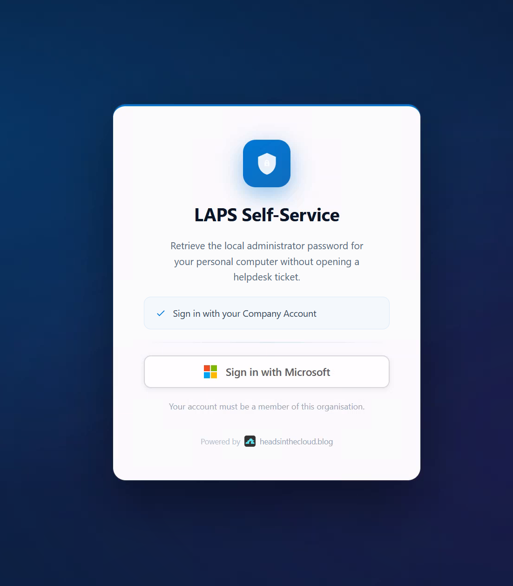
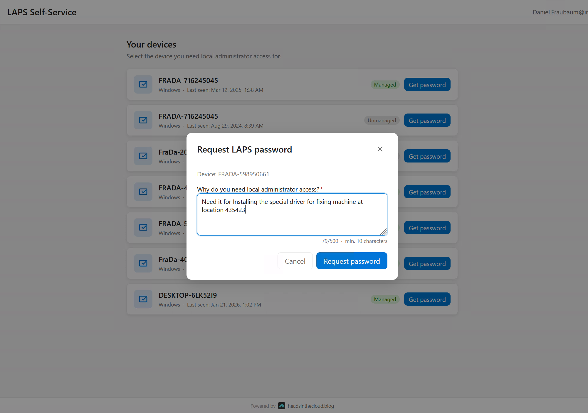
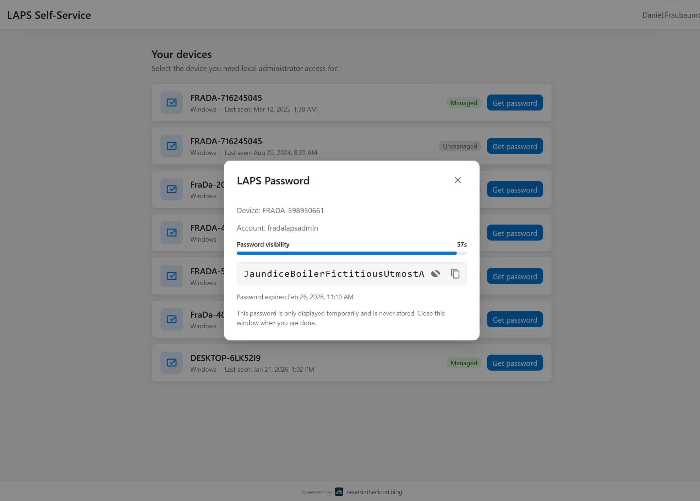
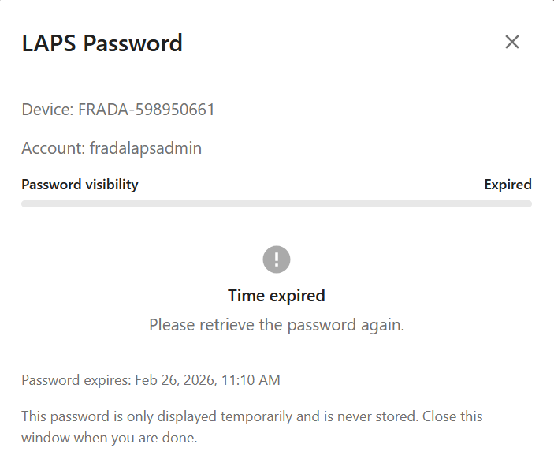
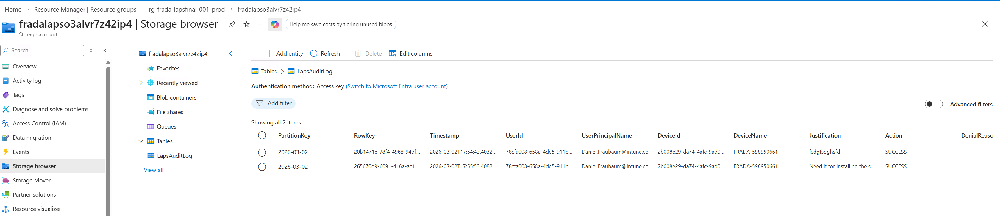

# 🔐 LAPS Self-Service Portal

A self-service portal for Windows LAPS — lets users securely retrieve the local administrator password for **their own device**, without a helpdesk ticket.

> Built on Azure Static Web Apps + Azure Functions, secured with Entra ID. Zero stored secrets for API access.

---

## ✨ Features

- 🖥️ **Only-my-device rule** — users can only see and retrieve passwords for devices registered to them (enforced server-side)
- 📝 **Mandatory justification** — configurable minimum length (default: 10 characters)
- ⏱️ **60-second auto-hide** — password disappears with a countdown bar; copy available during the window
- 📋 **Audit log** — every access attempt written to Azure Table Storage with user, device, justification, and IP
- 🔑 **Managed Identity** — no stored secrets for Graph API access
- 🛡️ **Easy Auth** — Entra ID JWT validated by Azure before your code runs; invalid or missing tokens rejected with 401 automatically
- 🎨 **CSS theming** — full white-labeling via CSS custom properties
- 🌐 **Custom domain** — supported via Azure Static Web Apps (Standard tier)

---

## 🧩 How it works

1. 👤 User signs in with their Entra ID account
2. 🖥️ The portal shows only **their own** registered devices (enforced server-side)
3. 📝 User selects a device and enters a justification
4. 🔓 LAPS password is shown for 60 seconds, then hidden automatically
5. 📋 Every access attempt is logged to Azure Table Storage

---

## 📸 Screenshots

| Sign-in | Justification |
|---------|--------------|
|  |  |

| Password (60 s countdown) | Auto-expired |
|--------------------------|-------------|
|  |  |

| Audit log (Azure Table Storage) |
|--------------------------------|
|  |

---

## ✅ Prerequisites

### 🛠️ Tools

| Tool | Min. Version | Install |
|------|-------------|---------|
| Azure CLI | 2.50 | [aka.ms/installazurecli](https://aka.ms/installazurecli) |
| Node.js | 24 LTS | [nodejs.org](https://nodejs.org) — includes npm |
| Static Web Apps CLI | latest | `npm install -g @azure/static-web-apps-cli` |

### 🔐 Azure permissions

| Scope | Role |
|-------|------|
| Azure subscription | **Contributor** |
| Entra ID tenant | **Application Administrator** (or Global Administrator) |
| Entra ID tenant | **Privileged Role Administrator** |

> 💡 A Global Administrator covers all of the above by default.

---

## 🚀 Deploy

### 🍎 macOS / Linux / WSL

**1. Install prerequisites** (once):

```bash
# macOS (Homebrew)
brew install azure-cli node
npm install -g @azure/static-web-apps-cli
```

**2. Clone and deploy:**

```bash
git clone https://github.com/daniel-fraubaum/laps-self-service-portal.git
cd laps-self-service-portal
chmod +x infra/deploy.sh
./infra/deploy.sh --project laps-prod
```

---

### 🪟 Windows (PowerShell)

**1. Install prerequisites** (once):

- 🔵 [Azure CLI](https://aka.ms/installazurecli) — download and run the MSI installer
- 🟢 [Node.js 24 LTS](https://nodejs.org) — download and run the installer (includes npm)
- 📦 Static Web Apps CLI:
  ```powershell
  npm install -g @azure/static-web-apps-cli
  ```

**2. Clone and deploy:**

```powershell
git clone https://github.com/daniel-fraubaum/laps-self-service-portal.git
cd laps-self-service-portal
.\infra\deploy.ps1 -Project laps-prod
```

---

The script asks for confirmation, then handles everything end-to-end (~10 minutes):

| Step | Action |
|------|--------|
| 1️⃣ | Creates (or reuses) the Entra ID App Registration, sets the identifier URI, generates a client secret |
| 2️⃣ | Deploys all Azure infrastructure via Bicep (single pass) |
| 3️⃣ | Assigns `Device.Read.All`, `DeviceLocalCredential.Read.All`, `Directory.Read.All` to the Managed Identity |
| 4️⃣ | Deploys the backend (Azure Functions) |
| 5️⃣ | Generates `frontend/authConfig.js` from deployment outputs |
| 6️⃣ | Deploys the frontend (Azure Static Web App) |
| 7️⃣ | Registers the Static Web App URL as a redirect URI on the App Registration |
| 8️⃣ | Grants admin consent for `User.Read` |

> 💾 **Save the client secret** printed at the end — it cannot be retrieved again and is needed for re-deployments (`--secret`).

> ⏳ **Allow a few minutes after deployment before the portal is fully functional.**
> Graph API role assignments (Managed Identity permissions) can take **2–5 minutes** to propagate in Entra ID.
> If you see `403` / permission errors right after deployment, simply wait and refresh.

---

## ☁️ What gets deployed

| Resource | Details |
|----------|---------|
| 📦 Resource Group | `rg-<projectName>` |
| 📊 Log Analytics + Application Insights | Telemetry and custom events |
| 💾 Storage Account | Runtime storage + `LapsAuditLog` audit table |
| ⚙️ App Service Plan | Linux B1 |
| 🌐 Azure Static Web App | Standard tier (SPA frontend) |
| ⚡ Azure Function App | Node.js 24, system-assigned Managed Identity |
| 🔐 Entra ID App Registration | MSAL user login + Easy Auth JWT validation |

---

## 💰 Estimated cost

All prices are approximate, based on **West Europe**, low/idle usage. Billed in USD by Azure.

| Resource | Tier | ~$/month |
|----------|------|----------|
| ⚙️ App Service Plan | Linux B1 | ~$13 |
| 🌐 Azure Static Web App | Standard | ~$9 |
| 💾 Storage Account | LRS, minimal usage | ~$1 |
| 📊 Log Analytics + App Insights | Pay-per-use, minimal ingestion | ~$1 |
| ⚡ Function App | Runs on B1 plan (no extra charge) | — |
| 🔐 Entra ID App Registration | Free tier | — |
| **Total** | | **~$24/month** |


---

## 🔒 Restricting access

> ⚠️ **Security requirement — do this before going live.**
> By default, **any user in your Entra ID tenant** can log in to the portal.
> Enable assignment enforcement immediately after deployment.

1. 🏢 **Entra ID** → **Enterprise Applications** → search for your app (e.g. `laps-prod-laps-portal`)
2. ⚙️ **Properties** → set **"Assignment required?"** to **Yes** → **Save**
3. 👥 **Users and groups** → **Add assignment** → select your security group (e.g. `SG-LAPS-Self-Service`)

Unassigned users receive `AADSTS50105` from Entra ID at sign-in — the portal and backend never see the request.

> 💡 Always assign a security group rather than individual users — group membership can then be managed independently in Entra ID.

See [docs/CONFIGURATION.md](docs/CONFIGURATION.md#access-control-restricting-who-can-use-the-portal) for CLI commands and details.

### 🛡️ Enforcing MFA

> ⚠️ **MFA cannot be enforced from the application code.** MSAL can request a step-up challenge, but this is bypassable — a user with a valid token from another app could call the backend API directly.
> The only secure enforcement is via **Entra ID Conditional Access**.

Create a Conditional Access Policy targeting your app:

1. **Entra ID** → **Security** → **Conditional Access** → **+ New policy**
2. **Users**: your LAPS security group (e.g. `SG-LAPS-Self-Service`)
3. **Target resources**: select your App Registration (e.g. `laps-prod-laps-portal`)
4. **Grant**: ✔️ Require multi-factor authentication
5. **Enable policy**: On → **Create**

Entra ID then enforces MFA at token issuance — before the portal or backend sees anything.

---

## 🔄 Re-deploy / updates

Re-use the client secret saved from the initial deployment to avoid rotating it:

```bash
# 🍎 macOS / Linux
./infra/deploy.sh --project laps-prod --secret "your-client-secret"
```

```powershell
# 🪟 Windows PowerShell
.\infra\deploy.ps1 -Project laps-prod -Secret "your-client-secret"
```

---

## 🧩 Partial deploys

```bash
# 🍎 macOS / Linux — code only (skip Bicep)
./infra/deploy.sh --project laps-prod --skip-infra

# 🍎 macOS / Linux — infrastructure only (skip backend + frontend)
./infra/deploy.sh --project laps-prod --secret "..." --skip-backend --skip-frontend
```

```powershell
# 🪟 Windows PowerShell — code only (skip Bicep)
.\infra\deploy.ps1 -Project laps-prod -SkipInfra

# 🪟 Windows PowerShell — infrastructure only
.\infra\deploy.ps1 -Project laps-prod -Secret "..." -SkipBackend -SkipFrontend
```

### 🌐 Custom domain

```bash
# 🍎 macOS / Linux
./infra/deploy.sh \
  --project  laps-prod \
  --location westeurope \
  --domain   laps.company.com \
  --secret   "your-client-secret"
```

```powershell
# 🪟 Windows PowerShell
.\infra\deploy.ps1 `
  -Project      laps-prod `
  -Location     westeurope `
  -CustomDomain laps.company.com `
  -Secret       "your-client-secret"
```

> ⚠️ **After enabling a custom domain, add the new URL as a redirect URI on the App Registration.**
> Open **Entra ID → App registrations → your-app → Authentication → Redirect URIs** and add `https://laps.company.com`.
> Logins will fail with `AADSTS50011` until this is done.
> See [docs/deployment.md](docs/deployment.md#update-app-registration-redirect-uri) for CLI commands.

---

## 🏗️ Architecture

```
[User Browser]
     │  MSAL Login (Authorization Code + PKCE)
     ▼
[Azure Static Web App]       ← Single-file SPA (index.html + MSAL.js)
     │  Bearer Token (Entra ID JWT)
     ▼
[Azure Function App]         ← Node.js 24, Easy Auth validates JWT before code runs
     │  App-only token (Managed Identity, no stored secrets)
     ▼
[Microsoft Graph]
     ├── /users/{id}/registeredDevices      ← ownership check (only-my-device rule)
     └── /deviceLocalCredentials/{id}       ← LAPS password retrieval

[Azure Table Storage]        ← LapsAuditLog (every access attempt, success or failure)
[Application Insights]       ← Telemetry and custom events
```

---

## 📁 Project structure

```
├── infra/
│   ├── deploy.sh                      ← Full deployment (Bash — macOS/Linux/WSL)
│   ├── deploy.ps1                     ← Full deployment (PowerShell — Windows)
│   ├── main.bicep                     ← Bicep template (subscription scope)
│   ├── bicepconfig.json               ← Bicep linting rules
│   ├── main.parameters.example.json   ← Parameters template
│   └── modules/
│       ├── monitoring.bicep           ← Log Analytics + Application Insights
│       ├── storage.bicep              ← Storage Account + audit table
│       ├── appServicePlan.bicep       ← Linux App Service Plan (B1)
│       ├── staticwebapp.bicep         ← Frontend Static Web App
│       └── functionapp.bicep          ← Backend Function App + Easy Auth
├── frontend/
│   ├── index.html                     ← Single-page SPA (CSS + JS fully embedded)
│   ├── authConfig.example.js          ← Template – copy to authConfig.js and fill in
│   ├── staticwebapp.config.json       ← SWA routing + security headers
│   └── css/
│       └── theme.css                  ← Branding overrides (colors, fonts, logo)
├── backend/
│   ├── host.json
│   ├── package.json
│   ├── eslint.config.js               ← ESLint 9 flat config
│   └── src/
│       ├── index.js                   ← Entry point (boots telemetry + registers functions)
│       ├── functions/
│       │   ├── myDevices.js           ← GET  /api/my-devices
│       │   └── lapsPassword.js        ← POST /api/laps-password
│       └── lib/
│           ├── auth.js                ← Easy Auth + JWKS JWT verification
│           ├── graph.js               ← Microsoft Graph (DefaultAzureCredential)
│           ├── telemetry.js           ← Application Insights custom events
│           └── audit.js               ← Azure Table Storage audit log
└── docs/
    ├── architecture.md                ← Architecture overview + auth flow
    ├── deployment.md                  ← Detailed deployment guide
    └── CONFIGURATION.md               ← All config values explained
```

> **Note on App Registration:** Created and configured by the deploy scripts via `az ad app` CLI — not via a Bicep module.

---

## 📚 Documentation

- 📖 [Deployment Guide](docs/deployment.md) — detailed steps, re-deploy, troubleshooting
- ⚙️ [Configuration Reference](docs/CONFIGURATION.md) — all config values and where they come from

---

## ⚖️ License

MIT — see [LICENSE](LICENSE)
